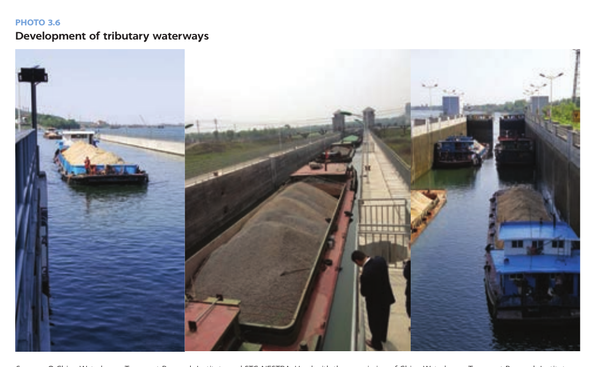
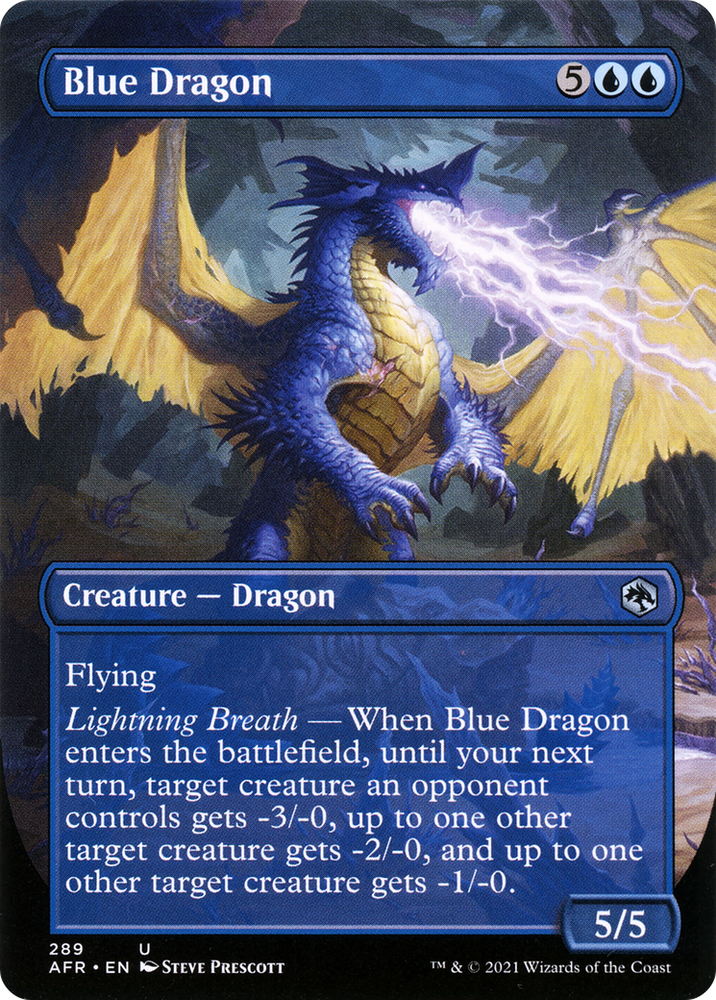

# 保持解谜就无人爆炸

## Current conclusion

当前 **没有可提交候选**。用户已经明确判错 `397:1964`、`WIRES` 与 `COPPER`；三者都不得在没有新机制证据时换单复数或近义词重投。

`397:1964` 仍可能是七格读出的中间查表码，因为它精确命中 ISO/R 397:1964；但从标准标题直接挑 `WIRES` 或 `COPPER` 的做法都已被判题否决。这说明尚缺一个受题面约束的后续操作，或者七图坐标链里至少一位只是后验凑成了 ISO 号。

这轮审计确认：

- Miracle Sudoku 的规则、两个口述给定数和唯一解都没有发现问题。
- 录音直接确定青、蓝、紫三格是 `r5c3`、`r6c3`、`r6c8`，解中数字为 `9,6,4`。
- 七张图各自提供一对 `行,列`；前三张直接来自图注/章节编号，第四张来自牌面 `5/5`，第五张来自 Faker 第 5 次夺冠且决赛取 3 胜，后两张来自 Mission 6 / Metal Slug 3D 与 Dota 6.80。
- 旧 Airships 6.3 与旧 Invoker 网页确实是误配，但现在分别找到了外观更吻合的 Big Shiee/Morden's Battleship 家族，以及 6.80 改动页中的绿色 Medusa 小图；这两项与录音直接给出的 `(6,3)`、`(6,8)` 互相校验。
- 所以 `397:1964` 作为中间码已经有可复现机制，并且精确命中一个与“拆弹/电线”题名高度相关的 ISO 标准；它仍然不能作为最终答案重复提交。

## 完整录音转写

以下是对 137.4 秒录音的完整清理转写。正常文字是多份本地 ASR 一致、且语义可人工复核的内容；方括号表示叠音、低清晰度或模型之间不一致，绝不把猜听写成事实。说话人没有稳定分轨，因此只按时间顺序记录。

| 时间 | 录音文字 |
| --- | --- |
| 00:00–00:02 | “OK，过了，下一题。” |
| 00:02–00:04 | “你网不好的话我先开了。” |
| 00:05–00:08 | “标题是《残酷天使的行动纲领》。” |
| 00:08–00:10 | “下面就是它的一句歌词。” |
| 00:10–00:14 | “勇敢的少年啊，快去创造奇迹那一句。” |
| 00:15–00:19 | “一共有八张图，一个大数独，下面七张小图片。” |
| 00:20–00:23 | “最底下是三个下划线，一个冒号，四个下划线。” |
| 00:24–00:30 | “数独的话，第五行第三列为 9，第六行第七列为 8。” |
| 00:30–00:33 | “9 和它下面那个，蓝色的，两个。”（可确认是在说两格相邻、呈青/蓝两种蓝色调；“蓝色的两个”是否为原句准确断句仍有歧义。） |
| 00:34–00:36 | “8 右边那个是紫色的。” |
| 00:37–00:40 | “这一组彩虹色，红橙黄绿青蓝紫。” |
| 00:40–00:43 | “除了蓝色都只有一格。红色……”（句尾被叠音截断。） |
| 00:44–00:47 | “[叠音；较可能是：‘对，你先用群里那张大图吧。’]” |
| 00:47–00:55 | “七张小图的话，第一张是某个国王的头像，不太认识。大家搜一下，我先整体报一遍。” |
| 00:56–00:59 | “第二张是一个大楼，顶上的露台。” |
| 01:00–01:03 | “第三张是一个港口，都认不出来。” |
| 01:04–01:10 | “第四张是一个蓝色的万智牌，牌上字都小，只看到一个神话生物在飞。” |
| 01:11–01:13 | “[听不清；四份 ASR 都近似‘面部神经体颜色那种’，语义不通，不能据此识别牌名。]” |
| 01:15–01:18 | “然后第五张图。第五张图是一个体育馆。” |
| 01:18–01:22 | “这个我还真认识吧，就是那个英国的 O2 体育馆。” |
| 01:22–01:25 | “我先[搜/去]吧。”“啊，行。” |
| 01:26–01:29 | “重点是里面有一个人举着奖杯庆祝。” |
| 01:29–01:32 | “一个穿着体育队服的亚洲人。” |
| 01:32–01:34 | “戴眼镜，瘦瘦的，感觉像[某国]人。”（国别词听不清。） |
| 01:35–01:38 | “我不知道啊，这方面我了解很少啊。” |
| 01:39–01:43 | “第六张图，是一个船的游戏建模，很大。” |
| 01:43–01:44 | “它好像不是航空母舰。” |
| 01:45–01:48 | “有履带，感觉是那种地上开的。” |
| 01:48–01:50 | “啊，应该是陆行舰。对。” |
| 01:51–01:53 | “不管了，看第七张图。” |
| 01:53–01:56 | “这个怎么说呢，是一个游戏的截图吧。” |
| 01:57–01:59 | “主体是一个绿色的女角色。” |
| 02:00–02:04 | “图是有点原始，旁边[左侧/左下角]有点像是那种……” |
| 02:04–02:07 | “[听不清；较像‘魔兽的技能……画面图标吧’，只能确认是在拿旁边的技能/UI 与《魔兽》类界面作比较。]” |
| 02:08–02:11 | “你会搜这个是吧？”“啊，行。” |
| 02:11–02:13 | “[叠音听不清；似乎是在分工让其中一人搜图。]” |
| 02:14–02:15 | “啊，我再盯一下这个数独。”（“盯”字不完全确定。） |
| 02:15–02:17 | 无新的可辨语句，只有尾音和环境底噪。 |

本地逐段 ASR、时间戳及不确定项仍保存在 [`artifacts/audio_transcript.md`](artifacts/audio_transcript.md) 与 `work/` 中。第四张牌的 01:11–01:13、以及第七张的 02:00–02:07 已经用三种有界识别方案交叉过，继续换模型没有产生新事实，因此不再用自动转写硬猜。

## Miracle Sudoku

“残酷天使的行动纲领”歌词中的“创造奇迹”提示 [Miracle Sudoku](https://ethmcc.github.io/miracle-sudoku/)。采用普通数独、反王步、反马步、正交相邻数字不得连续四组规则，并加入录音给定 `r5c3=9`、`r6c7=8`，保留脚本 [`artifacts/miracle_sudoku.py`](artifacts/miracle_sudoku.py) 得到唯一解：

```text
6 2 7 | 3 8 4 | 9 5 1
3 8 4 | 9 5 1 | 6 2 7
9 5 1 | 6 2 7 | 3 8 4
------+-------+------
2 7 3 | 8 4 9 | 5 1 6
8 4 9 | 5 1 6 | 2 7 3
5 1 6 | 2 7 3 | 8 4 9
------+-------+------
7 3 8 | 4 9 5 | 1 6 2
4 9 5 | 1 6 2 | 7 3 8
1 6 2 | 7 3 8 | 4 9 5
```

录音直接给出的彩色格只有后三个：

| 色 | 录音依据 | 已知格 | 解中数字 | 可靠性 |
| --- | --- | --- | --- | --- |
| 青 | `r5c3=9` 所在格是两格蓝色调之一 | `r5c3` | 9 | 高 |
| 蓝 | 9 正下方的另一蓝色调格 | `r6c3` | 6 | 高 |
| 紫 | `r6c7=8` 的右邻格 | `r6c8` | 4 | 高 |

复现：

```powershell
python rounds\shi-qi-love-in-chaos\nodes\b4-keep-solving-and-nobody-explodes\artifacts\miracle_sudoku.py --extract r5c3 r6c3 r6c8
```

输出为 `9 6 4`，并报告 `unique: True`。

## 七张图与坐标提取

这里把“录音描述 → 候选原图 → 两个数的独立来源 → 数独格 → 格中数字”完整拆开。图片均保存到 `artifacts/visual/`，下方可直接人工比对；不是只列一个搜索词。

| # / 色 | 录音描述与识别 | 两数来源 | 数独提取 | 可信度与人工检查点 |
| --- | --- | --- | --- | --- |
| 1 / 红 | Richard II 王座像；来源页标题为 [Plate **1.4: Portrait of Richard II**](https://scalar.missouri.edu/vm/vol1plate4-colorprints) | 图版号 `1.4` | `r1c4 = 3` | **较高。** 金色背景、王冠、紫袍、左手宝球、右手权杖。录音说“头像”可以是对小缩略图的概括；若原图没有这些要素则否决。 |
| 2 / 橙 | [Shunchang Museum](https://www.world-architects.com/de/uad-zhejiang/project/shunchang-museum)；项目图组的 **2.4 Urban terrace** | 图组小节 `2.4` | `r2c4 = 9` | **高。** 沿河白灰色弧形屋顶，露台上有巨大椭圆形采光口，和录音“大楼，顶上的露台”高度一致。 |
| 3 / 黄 | 世界银行 *Blue Routes for a New Era* 的 **Photo 3.6, Development of tributary waterways**；[原 PDF](https://documents1.worldbank.org/curated/en/908191600317351237/pdf/Blue-Routes-for-a-New-Era-Developing-Inland-Waterways-Transportation-in-China.pdf) | 照片编号 `3.6` | `r3c6 = 7` | **中等。** 实际是三幅内河航运图拼接：装砂驳船、船闸内货驳、双船闸；小图下被口述成“一个港口”合理，但需人工看构图。 |
| 4 / 绿 | [Blue Dragon](https://mtg.wtf/card/afr/289/Blue-Dragon)：蓝色万智牌，画面是带翼蓝龙喷吐闪电，规则含 Flying | 牌面力量/防御 `5/5` | `r5c5 = 1` | **中高。** `5/5` 直接印在右下角。Keiga 等别的蓝色飞龙也可能是 `5/5`，故角色名仍需看图；但只要原牌右下是 `5/5`，坐标不受牌名歧义影响。 |
| 5 / 青 | [Faker 在 2024 Worlds 决赛举杯的 Riot 照片](https://www.flickr.com/photos/lolesports/54112369706)，地点为伦敦 O2 | Faker 第 `5` 次夺得 Worlds；该决赛 T1 取得 `3` 局胜利（3–2） | `r5c3 = 9` | **很高。** 白色五冠纪念 T 恤、眼镜、银色 Worlds 奖杯、蓝色舞台；录音又直接给出了 `r5c3=9`，构成交叉校验。 |
| 6 / 蓝 | 外观最吻合的是 [Big Shiee 3D fan art](https://polycount.com/discussion/179391/big-shiee-metal-slug-fanart)：巨型战舰形车体、密集炮塔、整圈履带。相关的 [Morden's Battleship](https://metalslug.fandom.com/wiki/Morden%27s_Battleship) 是《Metal Slug 3D》的 Mission 6 Boss；该 Wiki 的 3D Boss 列表甚至写作第 6 项 “Morden Battle Ship (Big Shiee)” | Mission `6` + 游戏名 `3D` | `r6c3 = 6` | **数对高、精确型号中等。** Big Shiee 与 Morden's Battleship 在不同页面有“近亲/不同单位”的命名冲突；前者最像录音中的履带模型，后者最干净地产生 `(6,3)`。该格位置已由录音独立确定，不影响读数。 |
| 7 / 紫 | [Dota **6.80** 改动分析页](https://game8review.blogspot.com/2014/01/dota-680-changelog-reviewanalysis.html)中的 Medusa 小图：低分辨率、绿色女性脸、两侧绿色蛇形结构，确实像老式 Warcraft/Dota 图标 | 版本号 `6.80`，作坐标读 `6,8` | `r6c8 = 4` | **高。** 旧 Weebly 页的 Invoker 图只是误搜，并不能否定 Dota；新图与“绿色女角色、原始、像魔兽技能图标”逐项吻合，录音也独立给出 `r6c8`。 |

### 七图候选原图：人工核对版

#### 1 / 红：Richard II，Plate 1.4


#### 2 / 橙：Shunchang Museum，2.4 Urban terrace


#### 3 / 黄：Photo 3.6，Development of tributary waterways



#### 4 / 绿：Blue Dragon，5/5



#### 5 / 青：Faker，第 5 冠；决赛 3 胜


#### 6 / 蓝：Big Shiee 履带 3D 模型；对照 Morden's Battleship

第一张在视觉上最贴合录音，第二张则是《Metal Slug 3D》Mission 6 的游戏内相关战舰。人工核对时最关键的是原题小图究竟是“灰底侧视、履带完全外露”，还是“沙地正视、红色船体两侧突出”。


#### 7 / 紫：Dota 6.80 页面中的 Medusa

原网页源图只有 `59×33`；下面是按最近邻放大 12 倍的核对版，没有补画细节，[原尺寸文件在此](artifacts/visual/07-dota-680-medusa-source.png)。


### 坐标读数与最终一步

按红橙黄绿青蓝紫排列七对坐标，并在唯一解中取数：

```text
红      橙      黄      绿      青      蓝      紫
r1c4   r2c4   r3c6   r5c5   r5c3   r6c3   r6c8
  3      9      7      1      9      6      4
                 397:1964
```

这个机制比“拿格中数字索引图名”更好，原因有三：

1. 前四张图本身就出现或对应 `1.4`、`2.4`、`3.6`、`5/5`，都是合法的数独行列；不是先从格中数字倒推名字。
2. 后三对 `(5,3)、(6,3)、(6,8)` 与录音直接指出的青、蓝、紫格完全重合，形成独立交叉校验。尤其 Dota 6.80 页面确有符合描述的绿色 Medusa 图，旧 Invoker 误配已不再使用。
3. 若改走图名字符索引，青格数字是 `9`，却无法自然索引只有 5 个字母的 `FAKER`；必须临时改用长标题或全名，规则不统一。

底部格式正好是 `___:____`，所以七位读数应保留为 `397:1964`。它作为最终提交已被判错，但作为查表码会**精确**命中 [ISO/R 397:1964](https://www.iso.org/standard/4397.html)：

```text
ISO/R 397:1964
Wrapping test for copper and copper alloy wire
```

题名对《Keep Talking and Nobody Explodes》的改写已经提示“拆弹/电线”，所以 `WIRE(S)` 只是查表方向，不是答案；用户提交 `WIRES` 被拒绝也与此一致。标准标题中新出现、且同时覆盖 “copper” 与 “copper alloy wire” 的核心材料词为：

```text
COPPER
```

因此当前把 **`COPPER`** 作为可复现候选；没有提交记录，仍需用户或网站确认。

## Working hypotheses

1. **主路线：图像给坐标 → 数独取数 → ISO 查表 → `COPPER`。** 七对坐标、格式和标准标题形成完整闭环，当前最能解释全部材料。
2. **剩余视觉歧义集中在第 6 图。** 履带侧视模型明显是 Big Shiee；Mission 6 / Metal Slug 3D 的干净编号属于相关的 Morden's Battleship，社区资料又有把二者并写的情况。原题小图的具体构图可以区分名称，但蓝格与最终数字已由录音独立确定。
3. **图名索引路线降为低优先级。** 它对 `FAKER` 的第 9 字符没有统一定义，也解释不了为何七图会各自自然携带两位坐标；除非人工核对直接否定多张候选图，否则不再沿此路线造长标题。

## Submission history

只记录用户或比赛网站明确反馈过的提交。

| Date | Candidate | Result | Note |
| --- | --- | --- | --- |
| 2026-08-14 | `397:1964` | rejected | 用户明确报告“答案错误”。 |
| 2026-08-15 | `WIRES` | rejected | 用户明确报告“WIRES 不是答案，请不要乱猜”。 |
| 2026-08-15 | `COPPER` | rejected | 用户明确报告“copper 不是答案”。 |

## Important failed routes

- **`397:1964` 已作为提交答案被拒绝。** 即使之后证明它是中间查表码，也不能重新当最终答案提交。
- **`WIRES` 已被拒绝。** 不再改投 `WIRE`、`线路`、`WRAPPING TEST` 等近义变体。
- **`COPPER` 已被拒绝。** “从 ISO 标题挑最显眼材料词”不是充分提取；不再改投 `COPPER ALLOY`、`ALLOY` 等标题片段。
- **Airships 6.3 = 第六图** 这一具体来源放弃：6.3 时还没有录音所说的已发布履带陆行舰，且其像素画风不如 Big Shiee 模型吻合。不能把这条失败扩大成“所有 `(6,3)` 解释都错”。
- **Weebly 的 Dota 6.8 AI Invoker 图 = 第七图** 放弃：主体不是绿色女角色。它只是错误网页，不是否定 Dota 6.80；现在的 Medusa 候选来自另一张确实匹配描述的图。
- **ISO 修订链到 7802:2013** 虽然真实，但题面没有“沿修订链继续”的指令；该路线停止。
- 音频左右声道、频谱与元数据没有支持隐写的异常；倒放只产生高压缩率 ASR 幻觉。该路线停止。
- 第四张牌和第七张截图的含混短句经过三组有界 ASR 仍无新事实；不再靠增加模型次数硬猜。

## Evidence and artifacts

- [`artifacts/audio_transcript.md`](artifacts/audio_transcript.md)：逐段 ASR 来源、时间戳和不确定项。
- [`artifacts/extraction.md`](artifacts/extraction.md)：旧坐标假设的机器可复核摘要；以本文件的新审计为准。
- [`artifacts/miracle_sudoku.py`](artifacts/miracle_sudoku.py)：Miracle Sudoku 唯一解与任意坐标取值脚本。
- [`artifacts/visual/`](artifacts/visual/)：七项候选原图；第 6 项另保留 Big Shiee/Morden 两张判别图，第 7 项同时保留 59×33 原图和无插值放大图。
- PDF 渲染、候选图片、波形、频谱和各 ASR 原始输出留在 `work/`。

## Next action

请人工按本文件内嵌的七图逐项比对原题，尤其看第 3 图是否确为三联驳船/船闸图、第 4 图是否为右下 `5/5` 的 Blue Dragon，以及第 6 图是履带外露的 Big Shiee 侧视模型还是沙地中的 Morden's Battleship。若视觉核对通过，最有价值的外部动作是由用户自行提交 `COPPER` 并回报结果；本任务不会擅自提交。若任一图不符，则优先用其具体构图否决该行并替换来源，而不是改数独或重投 `397:1964` / `WIRES`。
