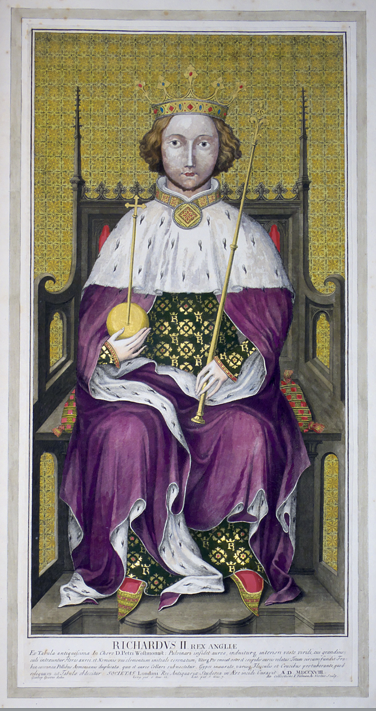
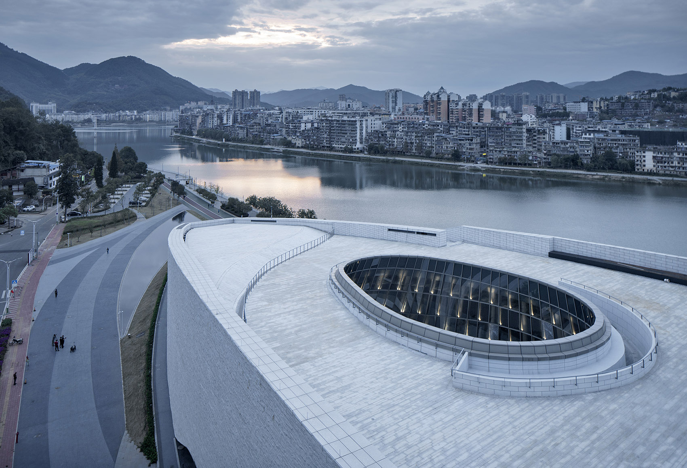
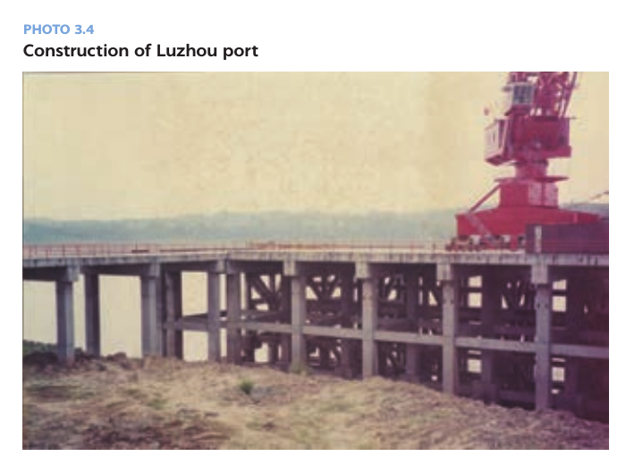
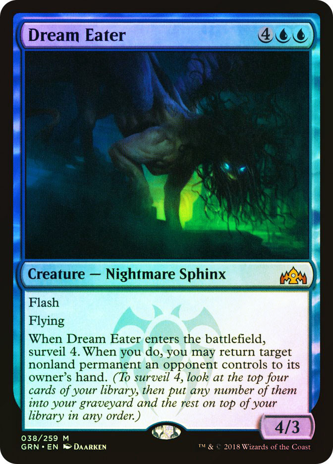
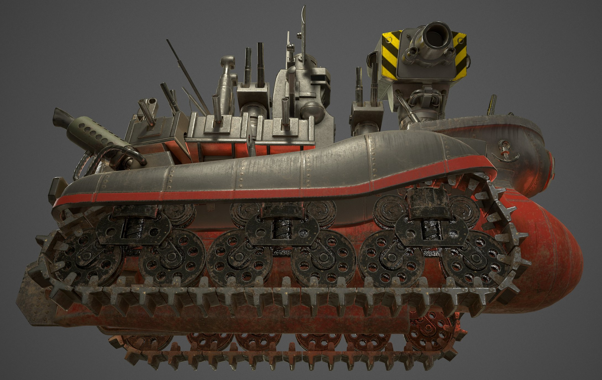
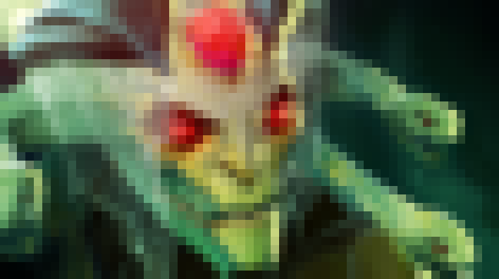

# 保持解谜就无人爆炸

## Current conclusion

当前候选是 **`396:3964`**。用户明确纠正“数字解出来应该就是答案”，所以这里到七格读数即停止，不再做 ISO、年份、查表或英文词后处理。

这轮不是改数独，而是撤销两处曾被 `397:1964` 结果反向影响的图像识别：

- 第三图旧选 `Photo 3.6` 只是因为它让结果精确命中 ISO；但那张图实际是三幅船闸/驳船的拼图。相同 PDF 中的 `Photo 3.4 — Construction of Luzhou port` 是单张港口建设照，与录音“一个港口”直接吻合，也和前两图的 `1.4、2.4` 构成连续编号。
- 第四图旧选 `Blue Dragon 5/5` 不够可信：图名和龙形都过于易认，而且它不是秘稀。模糊录音 `面部神经体颜色那种` 更自然的切分是“**蝙蝠形，整体蓝色那种**”；`Dream Eater` 正是蓝色秘稀的飞行梦魇斯芬克斯，暗色蝙蝠轮廓，右下明确为 `4/3`。
- 于是七图独立形成一条结构整齐的坐标链：`1.4 → 2.4 → 3.4 → 4/3 → 5/3 → 6/3 → 6.80`。后三对又和录音直接指出的青、蓝、紫格 `r5c3、r6c3、r6c8` 完全重合。
- Miracle Sudoku 仍为唯一解；在新坐标取数为 `3,9,6,3,9,6,4`，按底部 `___:____` 写成 **`396:3964`**。

## 完整录音转写

以下是对 137.4 秒录音的完整清理转写。正常文字是多份本地 ASR 一致、且语义可人工复核的内容；方括号表示叠音、低清晰度或模型之间不一致，绝不把猜听写成事实。说话人没有稳定分轨，因此只按时间顺序记录。

| 时间 | 录音文字 |
| --- | --- |
| 00:00–00:02 | “OK，过了，下一题。” |
| 00:02–00:04 | “你网不好的话我先开了。” |
| 00:05–00:08 | “标题是《残酷天使的行动纲领》。” |
| 00:08–00:10 | “下面就是它的一句歌词。” |
| 00:10–00:14 | “勇敢的少年啊，快去创造奇迹那一句。” |
| 00:15–00:19 | “一共有八张图，一个大数独，下面七张小图片。” |
| 00:20–00:23 | “最底下是三个下划线，一个冒号，四个下划线。” |
| 00:24–00:30 | “数独的话，第五行第三列为 9，第六行第七列为 8。” |
| 00:30–00:33 | “9 和它下面那个，蓝色的，两个。”（可确认是在说两格相邻、呈青/蓝两种蓝色调；“蓝色的两个”是否为原句准确断句仍有歧义。） |
| 00:34–00:36 | “8 右边那个是紫色的。” |
| 00:37–00:40 | “这一组彩虹色，红橙黄绿青蓝紫。” |
| 00:40–00:43 | “除了蓝色都只有一格。红色……”（句尾被叠音截断。） |
| 00:44–00:47 | “[叠音；较可能是：‘对，你先用群里那张大图吧。’]” |
| 00:47–00:55 | “七张小图的话，第一张是某个国王的头像，不太认识。大家搜一下，我先整体报一遍。” |
| 00:56–00:59 | “第二张是一个大楼，顶上的露台。” |
| 01:00–01:03 | “第三张是一个港口，都认不出来。” |
| 01:04–01:10 | “第四张是一个蓝色的万智牌，牌上字都小，只看到一个神话生物在飞。” |
| 01:11–01:13 | “[听不清；自动转写近似‘面部神经体颜色那种’。结合音素和上句，较可能是‘蝙蝠形，整体蓝色那种’，但不能当作完全确定的逐字稿。]” |
| 01:15–01:18 | “然后第五张图。第五张图是一个体育馆。” |
| 01:18–01:22 | “这个我还真认识吧，就是那个英国的 O2 体育馆。” |
| 01:22–01:25 | “我先[搜/去]吧。”“啊，行。” |
| 01:26–01:29 | “重点是里面有一个人举着奖杯庆祝。” |
| 01:29–01:32 | “一个穿着体育队服的亚洲人。” |
| 01:32–01:34 | “戴眼镜，瘦瘦的，感觉像[某国]人。”（国别词听不清。） |
| 01:35–01:38 | “我不知道啊，这方面我了解很少啊。” |
| 01:39–01:43 | “第六张图，是一个船的游戏建模，很大。” |
| 01:43–01:44 | “它好像不是航空母舰。” |
| 01:45–01:48 | “有履带，感觉是那种地上开的。” |
| 01:48–01:50 | “啊，应该是陆行舰。对。” |
| 01:51–01:53 | “不管了，看第七张图。” |
| 01:53–01:56 | “这个怎么说呢，是一个游戏的截图吧。” |
| 01:57–01:59 | “主体是一个绿色的女角色。” |
| 02:00–02:04 | “图是有点原始，旁边[左侧/左下角]有点像是那种……” |
| 02:04–02:07 | “[听不清；较像‘魔兽的技能……画面图标吧’，只能确认是在拿旁边的技能/UI 与《魔兽》类界面作比较。]” |
| 02:08–02:11 | “你会搜这个是吧？”“啊，行。” |
| 02:11–02:13 | “[叠音听不清；似乎是在分工让其中一人搜图。]” |
| 02:14–02:15 | “啊，我再盯一下这个数独。”（“盯”字不完全确定。） |
| 02:15–02:17 | 无新的可辨语句，只有尾音和环境底噪。 |

本地逐段 ASR、时间戳及不确定项仍保存在 [`artifacts/audio_transcript.md`](artifacts/audio_transcript.md) 与 `work/` 中。第四张牌的 01:11–01:13、以及第七张的 02:00–02:07 已经用三种有界识别方案交叉过；“蝙蝠形，整体蓝色”只作为带明示不确定性的语境复原，并由 Dream Eater 牌图独立校验，不把它伪装成 ASR 的确定输出。

## Miracle Sudoku

“残酷天使的行动纲领”歌词中的“创造奇迹”提示 [Miracle Sudoku](https://ethmcc.github.io/miracle-sudoku/)。采用普通数独、反王步、反马步、正交相邻数字不得连续四组规则，并加入录音给定 `r5c3=9`、`r6c7=8`，保留脚本 [`artifacts/miracle_sudoku.py`](artifacts/miracle_sudoku.py) 得到唯一解：

```text
6 2 7 | 3 8 4 | 9 5 1
3 8 4 | 9 5 1 | 6 2 7
9 5 1 | 6 2 7 | 3 8 4
------+-------+------
2 7 3 | 8 4 9 | 5 1 6
8 4 9 | 5 1 6 | 2 7 3
5 1 6 | 2 7 3 | 8 4 9
------+-------+------
7 3 8 | 4 9 5 | 1 6 2
4 9 5 | 1 6 2 | 7 3 8
1 6 2 | 7 3 8 | 4 9 5
```

录音直接给出的彩色格只有后三个：

| 色 | 录音依据 | 已知格 | 解中数字 | 可靠性 |
| --- | --- | --- | --- | --- |
| 青 | `r5c3=9` 所在格是两格蓝色调之一 | `r5c3` | 9 | 高 |
| 蓝 | 9 正下方的另一蓝色调格 | `r6c3` | 6 | 高 |
| 紫 | `r6c7=8` 的右邻格 | `r6c8` | 4 | 高 |

复现：

```powershell
python rounds\shi-qi-love-in-chaos\nodes\b4-keep-solving-and-nobody-explodes\artifacts\miracle_sudoku.py --extract r5c3 r6c3 r6c8
```

输出为 `9 6 4`，并报告 `unique: True`。

## 七张图与坐标提取

这里把“录音描述 → 候选原图 → 两个数的独立来源 → 数独格 → 格中数字”完整拆开。图片均保存到 `artifacts/visual/`，下方可直接人工比对；不是只列一个搜索词。

| # / 色 | 录音描述与识别 | 两数来源 | 数独提取 | 可信度与人工检查点 |
| --- | --- | --- | --- | --- |
| 1 / 红 | Richard II 王座像；来源页标题为 [Plate **1.4: Portrait of Richard II**](https://scalar.missouri.edu/vm/vol1plate4-colorprints) | 图版号 `1.4` | `r1c4 = 3` | **高。** 金色背景、王冠、紫袍、左手宝球、右手权杖；小缩略图会被口述成“国王头像”。它也开启前三图连续的 `1.4、2.4、3.4`。 |
| 2 / 橙 | [Shunchang Museum](https://www.world-architects.com/de/uad-zhejiang/project/shunchang-museum)；项目图组的 **2.4 Urban terrace** | 图组小节 `2.4` | `r2c4 = 9` | **高。** 沿河白灰色弧形屋顶，露台上有巨大椭圆形采光口，和录音“大楼，顶上的露台”高度一致。 |
| 3 / 黄 | 世界银行 *Blue Routes for a New Era* 的 [**Photo 3.4, Construction of Luzhou port**](https://documents1.worldbank.org/curated/en/908191600317351237/pdf/Blue-Routes-for-a-New-Era-Developing-Inland-Waterways-Transportation-in-China.pdf) | 照片编号 `3.4` | `r3c4 = 6` | **高。** 单张图就是岸边码头与红色港机，标题逐字写“泸州港建设”，比旧 `3.6` 三联船闸图更贴合“一个港口”；并延续 `1.4、2.4、3.4`。 |
| 4 / 绿 | [Dream Eater](https://scryfall.com/card/grn/38/dream-eater)：蓝色秘稀万智牌；类型是 Nightmare Sphinx，规则含 Flying，画面为暗蓝绿色的蝙蝠状飞行怪物 | 牌面力量/防御 `4/3` | `r4c3 = 3` | **高。** 右下 `4/3` 清楚；“秘稀 + 飞行神话生物 + 蝙蝠轮廓 + 整体蓝色”逐项吻合。旧 `Blue Dragon 5/5` 仅为非普通，而且图名与龙形太容易认，现作废。 |
| 5 / 青 | [Faker 在 2024 Worlds 决赛举杯的 Riot 照片](https://www.flickr.com/photos/lolesports/54112369706)，地点为伦敦 O2 | Faker 第 `5` 次夺得 Worlds；该决赛 T1 取得 `3` 局胜利（3–2） | `r5c3 = 9` | **很高。** 白色五冠纪念 T 恤、眼镜、银色 Worlds 奖杯、蓝色舞台；录音又直接给出了 `r5c3=9`，构成交叉校验。 |
| 6 / 蓝 | [Morden's Battleship](https://metalslug.fandom.com/wiki/Morden%27s_Battleship)：《Metal Slug 3D》中 Mission 6 的巨型陆行战舰；Big Shiee 的履带 3D 同人模型可作清晰外形对照 | Mission `6` + 游戏名 `3D` | `r6c3 = 6` | **数对很高、精确截图中等。** 录音“船的游戏建模、很大、地上开、陆行舰”吻合这一家族；`(6,3)` 又由口述蓝格独立确定。Big Shiee 只是外形对照，不再拿《Metal Slug 2》关卡号取数。 |
| 7 / 紫 | [Dota **6.80** 改动分析页](https://game8review.blogspot.com/2014/01/dota-680-changelog-reviewanalysis.html)中的 Medusa 小图：低分辨率、绿色女性脸、两侧绿色蛇形结构，确实像老式 Warcraft/Dota 图标 | 版本号 `6.80`，作坐标读 `6,8` | `r6c8 = 4` | **高。** 旧 Weebly 页的 Invoker 图只是误搜，并不能否定 Dota；新图与“绿色女角色、原始、像魔兽技能图标”逐项吻合，录音也独立给出 `r6c8`。 |

### 七图候选原图：人工核对版

#### 1 / 红：Richard II，Plate 1.4



#### 2 / 橙：Shunchang Museum，2.4 Urban terrace



#### 3 / 黄：Photo 3.4，Construction of Luzhou port



旧误选 `Photo 3.6` 仍保存在 [`artifacts/visual/03-blue-routes-photo-3-6.png`](artifacts/visual/03-blue-routes-photo-3-6.png)，供人工直接比较：它是三幅驳船/船闸拼图，不应概括成单个港口。

#### 4 / 绿：Dream Eater，4/3



旧误选 [`Blue Dragon 5/5`](artifacts/visual/04-blue-dragon.png) 保留作对照；它既不是秘稀，图中的龙也远比录音所说的未知“神话生物”容易辨认。

#### 5 / 青：Faker，第 5 冠；决赛 3 胜


#### 6 / 蓝：Morden's Battleship，Mission 6 / Metal Slug 3D

第一张是《Metal Slug 3D》的游戏内 Morden's Battleship；资料页把它明确列为 Mission 6 的 Boss。第二张是近亲 Big Shiee 的高清履带 3D 同人模型，只用于让人核对录音所说的“船、履带、地上开”的外形，不再从《Metal Slug 2》的关卡号取数。




#### 7 / 紫：Dota 6.80 页面中的 Medusa

原网页源图只有 `59×33`；下面是按最近邻放大 12 倍的核对版，没有补画细节，[原尺寸文件在此](artifacts/visual/07-dota-680-medusa-source.png)。



### 坐标读数与最终一步

按红橙黄绿青蓝紫排列七对坐标，并在唯一解中取数：

```text
红      橙      黄      绿      青      蓝      紫
r1c4   r2c4   r3c4   r4c3   r5c3   r6c3   r6c8
  3      9      6      3      9      6      4
                 396:3964
```

复现命令：

```powershell
python rounds\shi-qi-love-in-chaos\nodes\b4-keep-solving-and-nobody-explodes\artifacts\miracle_sudoku.py --extract r1c4 r2c4 r3c4 r4c3 r5c3 r6c3 r6c8
```

```text
unique: True
extract: 3963964 (r1c4=3 r2c4=9 r3c4=6 r4c3=3 r5c3=9 r6c3=6 r6c8=4)
```

这条机制现在有三层独立校验：

1. 前四图依次给出 `1.4、2.4、3.4、4/3`，不是从数独答案倒推出来的任意数字；尤其更正后的港口和牌图在视觉描述上明显优于旧候选。
2. 后三图给出的 `(5,3)、(6,3)、(6,8)` 与录音直接指出的青、蓝、紫格完全一致。第五、第六图也正好按录音列举的彩虹顺序落在上方青格 `r5c3`、下方蓝格 `r6c3`，所以不交换成 `...3694`。
3. 底部格式恰为 `___:____`。用户又明确说“数字解出来应该就是答案”，故 **`396:3964` 到此即为最终候选**，没有额外提取。

## Working hypotheses

1. **主路线：七图给七对坐标 → Miracle Sudoku 取七个数 → `396:3964`。** 目前每一对坐标均有统一来源，且后三对受录音直接约束。
2. **第 6 图仍有“精确截图”层面的歧义，但没有坐标歧义。** Big Shiee 高清模型最清楚地显示履带；Morden's Battleship 才是 Mission 6 / Metal Slug 3D。二者为近亲外形，且蓝格 `r6c3` 由录音独立固定。
3. **第 7 图是网页中的低分辨率 Medusa 图，而非完整战斗画面。** 它仍与“绿色女角色、原始、像魔兽技能图标”吻合，并且 Dota 6.80 与紫格 `r6c8` 交叉验证；若新候选被拒，这一图和第 1 图是下一批应继续寻找精确原图的项目。
4. **图名字符索引不成立。** 它无法统一处理 `FAKER` 的第 9 字符，也浪费了七图自然携带的两位坐标；不再沿这条路线造长标题。

## Submission history

只记录用户或比赛网站明确反馈过的提交。

| Date | Candidate | Result | Note |
| --- | --- | --- | --- |
| 2026-08-14 | `397:1964` | rejected | 用户明确报告“答案错误”。 |
| 2026-08-15 | `WIRES` | rejected | 用户明确报告“WIRES 不是答案，请不要乱猜”。 |
| 2026-08-15 | `COPPER` | rejected | 用户明确报告“copper 不是答案”。 |

## Important failed routes

- **`397:1964` 已作为提交答案被拒绝。** 现在能定位到两处具体错误：第三图用结果反向选了 `Photo 3.6`，第四图把未知飞行怪物草率配成 `Blue Dragon 5/5`。正确的强匹配分别是 `Photo 3.4` 与 `Dream Eater 4/3`。
- **ISO/R 397:1964 是后验巧合。** `WRAPPING` 曾被本文件列为候选，但用户明确纠正“数字本身就是答案”后，该后处理已撤销；它没有被用户报告为提交或判错，所以不写入 Submission history。
- **`WIRES` 已被拒绝。** 不再改投 `WIRE`、`线路` 等单复数或翻译变体。
- **`COPPER` 已被拒绝。** “从 ISO 标题挑最显眼材料词”不是充分提取；不再改投 `COPPER ALLOY`、`ALLOY` 等标题片段。
- **Airships 6.3 = 第六图** 这一具体来源放弃：6.3 时还没有录音所说的已发布履带陆行舰，且其像素画风不如 Big Shiee 模型吻合。不能把这条失败扩大成“所有 `(6,3)` 解释都错”。
- **Weebly 的 Dota 6.8 AI Invoker 图 = 第七图** 放弃：主体不是绿色女角色。它只是错误网页，不是否定 Dota 6.80；现在的 Medusa 候选来自另一张确实匹配描述的图。
- **交换青、蓝两格得到 `396:3694`** 暂不采用：录音先按“红橙黄绿青蓝紫”列色，随后又按同一顺序报七张小图；第五图 `(5,3)` 与第六图 `(6,3)` 正好分别验证上方青格、下方蓝格。只有原图颜色顺序被新证据推翻时才重开。
- 音频左右声道、频谱与元数据没有支持隐写的异常；倒放只产生高压缩率 ASR 幻觉。该路线停止。
- 第四张牌和第七张截图的含混短句经过三组有界 ASR 后仍不适合逐字硬猜；本轮只采用可由完整语义和图片共同支持的“蝙蝠形、整体蓝色”读法。

## Evidence and artifacts

- [`artifacts/audio_transcript.md`](artifacts/audio_transcript.md)：逐段 ASR 来源、时间戳和不确定项。
- [`artifacts/extraction.md`](artifacts/extraction.md)：新旧坐标逐项对照与机器可复核命令。
- [`artifacts/miracle_sudoku.py`](artifacts/miracle_sudoku.py)：Miracle Sudoku 唯一解与任意坐标取值脚本。
- [`artifacts/visual/`](artifacts/visual/)：七项候选原图；另保留第三、第四图的旧误选作人工对照，第 6 项保留 Big Shiee/Morden 两张判别图，第 7 项同时保留 59×33 原图和无插值放大图。
- PDF 渲染、候选图片、波形、频谱和各 ASR 原始输出留在 `work/`。

## Next action

最有价值的外部检验是由用户先人工对照本页的 **Photo 3.4** 与 **Dream Eater 4/3** 两张更正图；若吻合，再自行提交 **`396:3964`** 并回报判题结果，本任务不会擅自提交。若仍被拒绝，优先继续找第 1、6、7 图的精确原始缩略图并核查色块，而不是恢复 ISO 后处理或改猜英文词。无论如何，不重投 `397:1964`、`WIRES` 或 `COPPER`。
