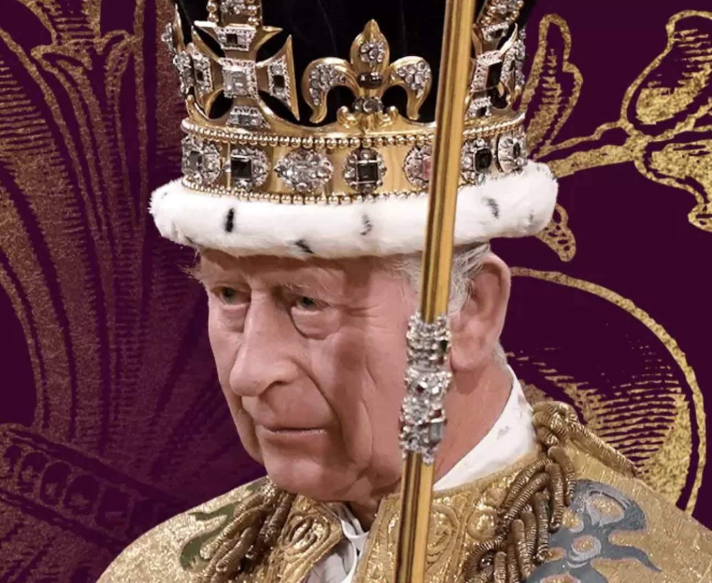
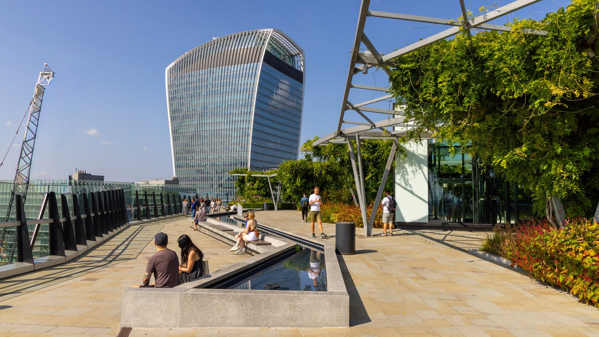
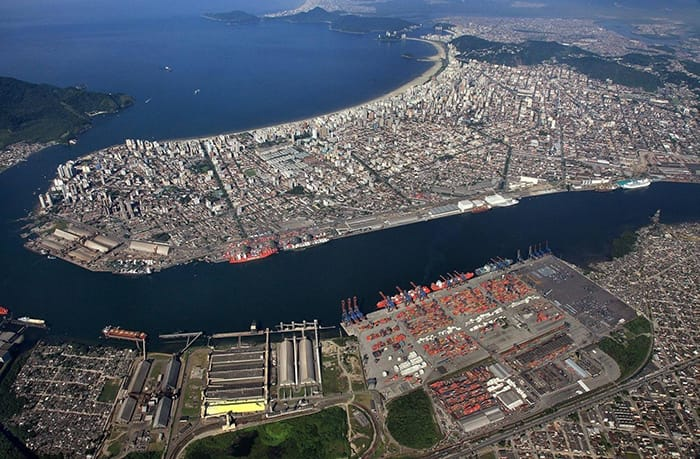
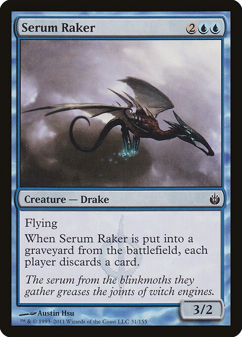
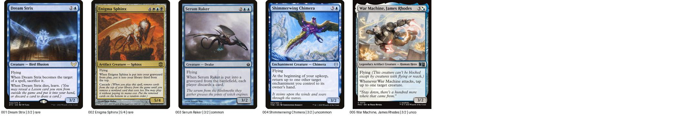
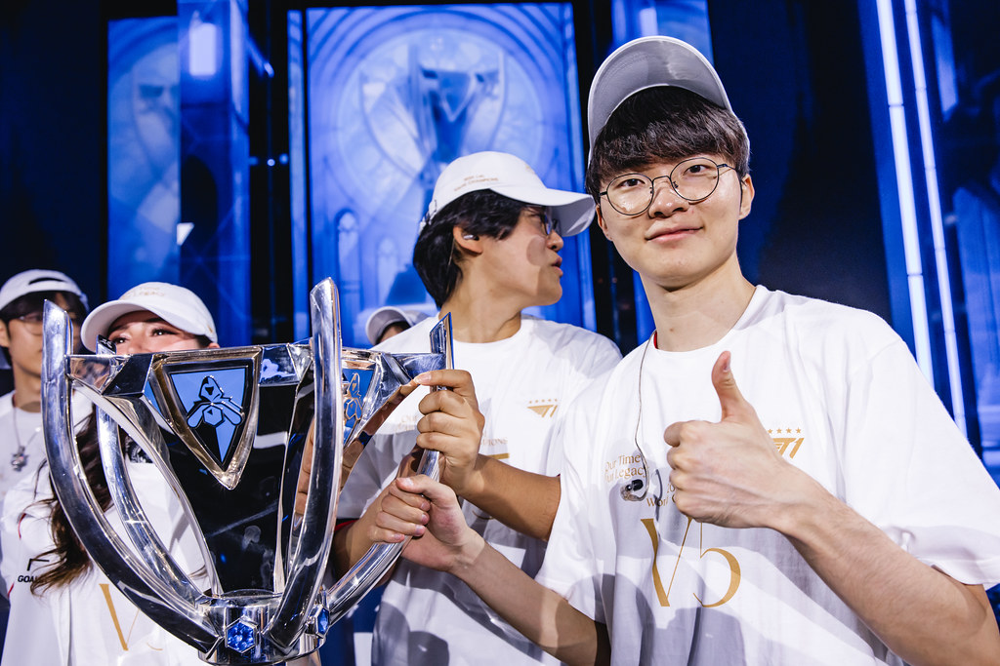
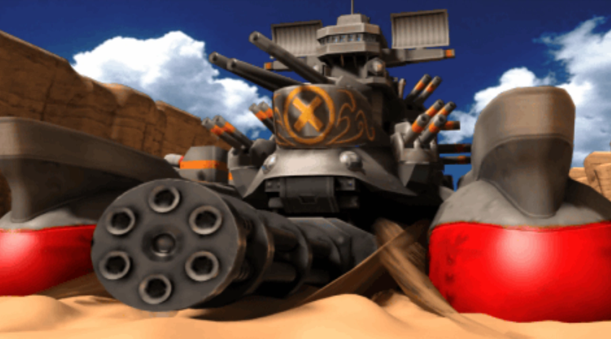
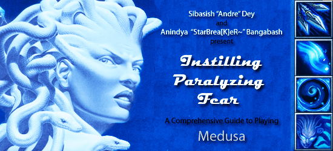

# 保持解谜就无人爆炸

## Current conclusion

`HEAD` 已由用户明确判错并移入失败路线。重新把图片的**具体英文专名**和
牌面/人物/载具本身能提供的坐标相互校验后，当前最强候选改为：

```text
Miracle Sudoku 七个彩色格
        ↓
     396:5464
        ↓ 依次作为七个英文标识的 1-based 索引
CHARLES / SKY GARDEN / SANTOS :
SERUM RAKER / FAKER / MORDEN'S BATTLESHIP / MEDUSA
        ↓
      ANS:MENU
```

其中第 4 图是关键修正：*Serum Raker* 是蓝色、Flying、画面为飞行的
Drake，右下角 `3/2` 指向 `r3c2=5`，而 `SERUMRAKER[5]=M`。第 6 图
*Morden's Battleship* 的资料明确同时给出《Metal Slug **3D**》与
Mission **6**，闭合 `r6c3=6`，而 `MORDENSBATTLESHIP[6]=N`。第 7 图
*Medusa* 的旧式 Dota 指南图带一列四个技能图标，页面标题又明确写
Dota `6.78`，与录音给定 `r6c7=8` 交叉验证；紫格 `r6c8=4` 后有
`MEDUSA[4]=U`。后三项现在都同时保留具体专名和数值来源。

候选仍只有**中等置信**，不能当作已确认答案：保存下来的 SingleFile 页面
没有舍友屏幕里的七张原图；第 1–3 图的 `CHARLES / SKY GARDEN / SANTOS`
以及红橙黄三格坐标仍是待比对识别，第 5 图虽几乎可认作 Faker，`r5c2`
也尚缺原图直接显示。曾考虑的 `ANS:EASY` 不能替代这些缺口：它把
Richard/Shunchang/Luzhou 的编号来源和 Charles/Sky Garden/Santos 的名称
混在一起，而且 `WORLDCHAMPION[9]` 实为 M，不是 A。下文把完整录音、
七张对照图、每步索引和风险全部列出，人工确认这些外形后才建议尝试提交
**`MENU`**。

## 完整录音文字

录音长约 137.4 秒。下表合并了三组有界本地 ASR 与逐段复核；方括号中
是叠音或仍不足以逐字确认的部分，不把猜听写成事实。

| 时间 | 录音文字 |
| --- | --- |
| 00:00–00:02 | “OK，过了，下一题。” |
| 00:02–00:04 | “你网不好的话我先开了。” |
| 00:05–00:08 | “标题是《残酷天使的行动纲领》。” |
| 00:08–00:10 | “下面就是它的一句歌词。” |
| 00:10–00:14 | “勇敢的少年啊，快去创造奇迹那一句。” |
| 00:15–00:19 | “一共有八张图，一个大数独，下面七张小图片。” |
| 00:20–00:23 | “最底下是三个下划线，一个冒号，四个下划线。” |
| 00:24–00:30 | “数独的话，第五行第三列为 9，第六行第七列为 8。” |
| 00:30–00:33 | “9 和它下面那个，蓝色的，两个。”（可确认是在说两个相邻蓝格；断句仍有轻微歧义。） |
| 00:34–00:36 | “8 右边那个是紫色的。” |
| 00:37–00:40 | “这一组彩虹色，红橙黄绿青蓝紫。” |
| 00:40–00:43 | “除了蓝色都只有一格。红色……”（句尾被叠音截断。） |
| 00:44–00:47 | [叠音；较可能是“对，你先用群里那张大图吧。”] |
| 00:47–00:55 | “七张小图的话，第一张是某个国王的头像，不太认识。大家搜一下，我先整体报一遍。” |
| 00:56–00:59 | “第二张是一个大楼，顶上的露台。” |
| 01:00–01:03 | “第三张是一个港口，都认不出来。” |
| 01:04–01:10 | “第四张是一个蓝色的万智牌，牌上字都小，只看到一个神话生物在飞。” |
| 01:11–01:13 | [听不清；自动转写近似“面部神经体颜色那种”。“蝙蝠形，整体蓝色”只是音素上的一种可能，不作为确定逐字稿。] |
| 01:15–01:18 | “然后第五张图。第五张图是一个体育馆。” |
| 01:18–01:22 | “这个我还真认识吧，就是那个英国的 O2 体育馆。” |
| 01:22–01:25 | “我先[搜/去]吧。”“啊，行。” |
| 01:26–01:29 | “重点是里面有一个人举着奖杯庆祝。” |
| 01:29–01:32 | “一个穿着体育队服的亚洲人。” |
| 01:32–01:34 | “戴眼镜，瘦瘦的。”[后半个国别词听不清。] |
| 01:35–01:38 | “我不知道啊，这方面我了解很少啊。” |
| 01:39–01:43 | “第六张图，是一个船的游戏建模，很大。” |
| 01:43–01:44 | “它好像不是航空母舰。” |
| 01:45–01:48 | “有履带，感觉是那种地上开的。” |
| 01:48–01:50 | “啊，应该是陆行舰。对。” |
| 01:51–01:53 | “不管了，看第七张图。” |
| 01:53–01:56 | “这个怎么说呢，是一个游戏的截图吧。” |
| 01:57–01:59 | “主体是一个绿色的女角色。” |
| 02:00–02:04 | “图是有点原始，旁边[左侧/左下角]有点像是那种……” |
| 02:04–02:07 | [听不清；较像“魔兽的技能……画面图标吧”，只能确认是在拿旁边的技能/UI 与《魔兽》类界面作比较。] |
| 02:08–02:11 | “你会搜这个是吧？”“啊，行。” |
| 02:11–02:13 | [叠音听不清；似乎是在分工让其中一人搜图。] |
| 02:14–02:15 | “啊，我再盯一下这个数独。”（“盯”字不完全确定。） |
| 02:15–02:17 | 无新的可辨语句，只有尾音和环境底噪。 |

带时间戳的独立副本和事实/解释分层见
[`artifacts/audio_transcript.md`](artifacts/audio_transcript.md)。录音只说“三个
下划线、冒号、四个下划线”，并没有直接念出 `ANS`；`ANS` 是当前七次
索引的结果，也与用户听感相符，但它不是对原音的改写或独立证明。

## Miracle Sudoku

歌词里的“创造奇迹”提示 [Miracle Sudoku](https://ethmcc.github.io/miracle-sudoku/)。
采用普通数独、反王步、反马步、正交相邻数字不得连续四组规则，加入
录音给定 `r5c3=9`、`r6c7=8`，脚本
[`artifacts/miracle_sudoku.py`](artifacts/miracle_sudoku.py) 得到唯一解：

```text
6 2 7 | 3 8 4 | 9 5 1
3 8 4 | 9 5 1 | 6 2 7
9 5 1 | 6 2 7 | 3 8 4
------+-------+------
2 7 3 | 8 4 9 | 5 1 6
8 4 9 | 5 1 6 | 2 7 3
5 1 6 | 2 7 3 | 8 4 9
------+-------+------
7 3 8 | 4 9 5 | 1 6 2
4 9 5 | 1 6 2 | 7 3 8
1 6 2 | 7 3 8 | 4 9 5
```

目前沿用的七个彩色格及其数字是：

| 色 | 格 | 数字 | 位置证据 |
| --- | --- | ---: | --- |
| 红 | `r1c4` | 3 | 当前重建；原音在说出“红色……”后被叠音打断，缺原图直证 |
| 橙 | `r2c4` | 9 | 当前重建；缺原图直证 |
| 黄 | `r3c4` | 6 | 当前重建；缺原图直证 |
| 绿 | `r3c2` | 5 | 第 4 张 *Serum Raker* 牌面直接给 `3/2`；仍需原图确认牌名 |
| 青 | `r5c2` | 4 | 第 5 图序号 5 与 O2 的 2 构成 `(5,2)`；这是机制推断，不是原音直说 |
| 蓝 | `r6c3` | 6 | 原音直接固定上下两个蓝格为 `r5c3/r6c3`；当前提取下格 |
| 紫 | `r6c8` | 4 | 原音直接说给定 `r6c7=8` 的右格为紫色 |

复现：

```powershell
python rounds\shi-qi-love-in-chaos\nodes\b4-keep-solving-and-nobody-explodes\artifacts\miracle_sudoku.py --extract r1c4 r2c4 r3c4 r3c2 r5c2 r6c3 r6c8
```

期望末行：

```text
unique: True
extract: 3965464 (r1c4=3 r2c4=9 r3c4=6 r3c2=5 r5c2=4 r6c3=6 r6c8=4)
```

这就是显示成 `396:5464` 的七个索引。纯数字提交已被拒绝；当前机制把
它们分别用于七个英文词，而不是把整串当答案。

## 七张图和逐项提取

下面的图片不是从原页恢复出的题图，而是按录音描述找到的人工对照图。
“强”表示描述高度特异；“候选”表示仍可能有同类对象。表中数字取自上节
暂定彩色格，而不是图片序号本身。

| # / 色 | 录音中的图 | 当前英文标识 | 索引 | 提取 | 判断 |
| --- | --- | --- | ---: | --- | --- |
| 1 / 红 | 某个国王头像 | `CHARLES` | 3 | **A** | 候选；需比对具体国王 |
| 2 / 橙 | 大楼顶上的露台 | `SKY GARDEN` | 9 | **N** | 候选；需比对建筑外形 |
| 3 / 黄 | 一个港口 | `SANTOS` | 6 | **S** | 候选；需比对港区布局 |
| 4 / 绿 | 蓝色万智牌，飞行的神话生物 | `SERUM RAKER` | 5 | **M** | 牌面外形、Flying、`3/2` 均相符；强候选 |
| 5 / 青 | O2、戴眼镜的亚洲选手举杯 | `FAKER` | 4 | **E** | 强匹配 |
| 6 / 蓝 | 有履带、地上开的船式游戏建模 | `MORDEN'S BATTLESHIP` | 6 | **N** | *Metal Slug 3D* Mission 6，同时闭合 `(6,3)` |
| 7 / 紫 | 老式游戏界面中的绿色女角色 | `MEDUSA` | 4 | **U** | Dota 6.78 旧指南与四技能图标相符，并对照 `r6c7=8` |

### 1 / 红：Charles 候选



人工检查点：王冠、面部角度、服饰和背景。这里只确认 `CHARLES[3]=A` 能
参与干净提取；保存图是 King Charles III 的代表性候选，不声称已经与
录音中所见题图一致。若原图不是 Charles，这一项就必须整体推翻，不能为
了字母 A 改用另一个国王。公开对照：[英国王室加冕肖像](https://www.royal.uk/coronation-portraits)。

### 2 / 橙：Sky Garden 候选



人工检查点：是否是伦敦 20 Fenchurch Street（“Walkie-Talkie”）顶部的
公共花园/露台，尤其比较弧形玻璃顶和露台绿化。若原图确是该地点，
`SKYGARDEN[9]=N`。公开对照：[Sky Garden](https://skygarden.london/)。

### 3 / 黄：Santos 港候选



人工检查点：航道两侧连续码头、集装箱堆场、岸线走向。录音只给出“一个
港口”，因此这一项不能只凭类别认定；若题图是 Port of Santos，
`SANTOS[6]=S`。公开对照：[Port of Santos](https://www.portodesantos.com.br/en/)。

### 4 / 绿：Serum Raker 候选



这是当前路线最关键的独立校验。*Serum Raker* 是蓝色牌，图中是蝙蝠/龙形
的飞行 Drake，规则文字第一行就是 `Flying`，右下角清楚写着 `3/2`。把
牌面数值当坐标得到 `r3c2=5`，再用这个 5 索引牌名：

```text
SERUMRAKER[5] = M
```

人工检查点：题图牌名能否看出 `Serum Raker`、画面是否为灰蓝天空里的
黑色长尾飞龙、费用是否 `2UU`、右下角是否 `3/2`。有界 Scryfall 检索还
留下 *Dream Strix* 与 *Shimmerwing Chimera* 两个同为 `3/2`、第五字母
也为 M 的替代项；三者中 *Serum Raker* 最贴近录音里不确定的“蝙蝠形、
整体蓝色”。这仍必须靠原图定案。公开牌面：[Scryfall](https://scryfall.com/card/mbs/31/serum-raker)。



接触表从左到右是 *Dream Strix / Enigma Sphinx / Serum Raker /
Shimmerwing Chimera / War Machine, James Rhodes*。其中 Enigma Sphinx 是
`5/4`，坐标会落到 `r5c4=5`，也能给 M；但其金橙牌框与“整体蓝色”冲突。
其余三张 `3/2` 候选中，War Machine 又明显不是“神话生物”，而且删除
空格后 `WARMACHINE[5]=A`，并不能提取 M；所以实际需要和原图重点比对
的是第 1、3、4 张。

### 5 / 青：Faker 在 O2 举杯



这是七项中最强的识别：O2 场馆、银色 Worlds 奖杯、戴眼镜且身材偏瘦的
亚洲电竞选手都吻合 Faker。当前把“第 5 图”和场馆名 **O2** 解释为坐标
`(5,2)`，故 `r5c2=4`，再得 `FAKER[4]=E`。人物识别强，但 `(5,2)` 的
坐标读法还需要题图颜色位置确认。公开原图：[LoL Esports / Riot](https://www.flickr.com/photos/lolesports/54112369706)。

### 6 / 蓝：Morden's Battleship



*Morden's Battleship* 是《Metal Slug 3D》的 Boss；资料页明确写它出现在
Mission 6。于是游戏名的 `3D` 和 Mission 的 `6` 给出坐标 `(6,3)`，正好
落在录音所说的下方蓝格 `r6c3=6`。规范化名称的第六个字母又是 N：

```text
MORDENSBATTLESHIP[6] = N
```

人工检查点：是否是巨大灰黑船体、正面六管机枪、两侧履带/浮筒和密集炮塔。
原网页的 infobox 同时列出 `Metal Slug 3D`，正文写明 “Mission 6 boss”：
[Metal Slug Wiki](https://metalslug.fandom.com/wiki/Morden%27s_Battleship)。
*Cocoon*（另存于 `artifacts/visual/06-cocoon-candidate.webp`）是外形很近的
替代图，且第六字母也为 N，但没有同样清楚的 `(6,3)` 来源，故不作为主识别。

### 7 / 紫：Medusa



这张老式 Dota 指南横幅以绿色/蓝绿色的 Medusa 女性为主体，右侧正好竖排
四个 Warcraft III 风格技能图标，贴近录音的“图有点原始”“绿色女角色”
和“旁边像魔兽的技能图标”。原页面标题明确为 **Dota 6.78**；其中
`6,7,8` 又与录音给出的 `r6c7=8` 相符，紫色格就是右侧 `r6c8=4`，所以：

```text
MEDUSA[4] = U
```

人工检查点：头发是否为蛇、右侧是否正是四个蓝色技能图标、画面中能否
看到 `Medusa`。*Lady Vashj* 也有绿色女性和 Warcraft UI，仍是图像层面的
替代项；但它没有 Dota `6.78` 这一数字交叉校验。对照页：
[Dota 6.78 Medusa guide](https://blogdota.ru/gajdy-po-geroyam/medusa.html)。

## 统一字母索引

所有词使用同一规则：转大写，删去空格和标点，只数 `A–Z`，然后按数独
数字作 1-based 索引。

| 色 | 名称 | 标准化 | 数字 | 字母 |
| --- | --- | --- | ---: | --- |
| 红 | `CHARLES` | `CHARLES` | 3 | **A** |
| 橙 | `SKY GARDEN` | `SKYGARDEN` | 9 | **N** |
| 黄 | `SANTOS` | `SANTOS` | 6 | **S** |
| 绿 | `SERUM RAKER` | `SERUMRAKER` | 5 | **M** |
| 青 | `FAKER` | `FAKER` | 4 | **E** |
| 蓝 | `MORDEN'S BATTLESHIP` | `MORDENSBATTLESHIP` | 6 | **N** |
| 紫 | `MEDUSA` | `MEDUSA` | 4 | **U** |

所以：

```text
CHARLES[3]          = A
SKY GARDEN[9]       = N
SANTOS[6]           = S
SERUM RAKER[5]      = M
FAKER[4]            = E
MORDENSBATTLESHIP[6] = N
MEDUSA[4]           = U

ANS:MENU
```

可用 [`artifacts/test_indexing.py`](artifacts/test_indexing.py) 复现。后四项
现在全部使用画面对象的具体英文专名；其中 Morden's Battleship 还同时给出
`(6,3)`，Medusa 来源页的 `6.78` 则复核录音给定。它们统一得到正常可提交词
`MENU`。不过 `ANS` 仍可能是前三图选词后的巧合，且红橙黄三格位置未从
保存文件恢复，因此置信度只能是中等。

## 与 `EASY` 路线的判别

`EASY` 是本轮重点核验的竞争假设，但目前不能替代 `MENU`：

- 它沿用 Richard II / Shunchang Museum / Luzhou port 三张候选网页的
  `1.4 / 2.4 / 3.4` 来定坐标，却改用另一组三个对象名 `CHARLES /
  SKY GARDEN / SANTOS` 来取 `ANS`；在没有原图时这是两组图片的混搭。
- 第 5 项若用自然标签 `WORLD CHAMPION`，按本文统一的“去空格标点、只数
  A–Z”规则，第 9 字母是 **M**，不是 A。改成 `T1 WORLD CHAMPION` 才能
  得 A，但该短语既不是 Flickr 原图标题（标题是 *League of Legends World
  Championship 2024 - Finals*），也没有独立理由优先于 `FAKER`。
- 第 7 项 Lady Vashj 的第四字母确为 Y，但 Medusa 对照页同时提供了更贴近
  录音的四技能指南横幅和 `Dota 6.78` 数字校验。因此 `EASY` 目前只是
  后验可拼出的替代词，不升级为候选，也没有提交判定可写入历史。

## 原页与检索的负证据

- 已将 SingleFile HTML 解包并检查资源。保存页只有标题、引文和 MP3；
  舍友屏幕中的大数独及七张小图没有嵌入页面。
- HTML 中没有字面量 `ANS` 或七图文件；因此本地文件既不能证明也不能
  否定 `ANS:`。
- 站点脚本只暴露通用的题面/答案日志/提示/解析接口。按照项目规则没有
  调用共享 Hunt API，也没有提交答案。
- 用中英文题名、英文 slug、Miracle Sudoku 和多项图片描述检索公开网页，
  没有找到可索引的原题副本；对象共现检索也只有各自独立资料，没有题面或
  复盘命中。网络检索到此停止。
- 万智牌检索先后做了三个有界实验：把原音误当“神话稀有度”、强限 `4/3`
  都未得到稳定对象；最终允许牌面 P/T 本身给坐标，并只检查落在数独数字
  5 的坐标，得到 *Serum Raker* 等四个标准化后“第五字母 M”的 flying
  候选（第五个 API 命中 *War Machine* 是空格造成的正则假阳性）。
  这已达到本实验族上限，不再继续扩大检索；下一步只能拿原图比牌面。

### 本轮 SingleFile 与音频复核（2026-08-16）

- 解包后的 `work/singlefilez/manifest.json` 只有 `index.html`、KaTeX
  字体、CSS、`favicon.ico` 和一个头像/图标 `61.webp`；`images/` 中没有
  数独截图或七张小图。故本地保存页不能用来确认任何彩色格坐标或图片专名。
- 按 [`work/audio_asr_experiment.md`](work/audio_asr_experiment.md) 的预先
  界限，使用 `base` 模型完成三组且仅三组配置：`full-default`、
  `full-nocontext`、`critical-channels`（左右声道各复核彩色、牌面、游戏
  片段）。结果见 [`work/asr/whisper_results.json`](work/asr/whisper_results.json)。
  三组重复了“第五行第三列为 9 / 第六行第七列为 8”、蓝色相邻格、蓝色
  万智牌/飞行神话生物、O2 体育馆选手、履带陆行舰、绿色女角色等概括，
  但没有稳定恢复新的坐标、牌名、人物名或游戏名；左右声道也没有分歧信号。
- 因此 ASR 假设族已达到三次无新事实的停止条件。继续换模型或无界搜词只会
  放大幻听，不能提高 `MENU` 的可复现性；当前缺口只能由原题截图/页面重新
  提供后，以图像比对解决。

## Submission history

| Date | Candidate | Result | Note |
| --- | --- | --- | --- |
| 2026-08-14 | `397:1964` | rejected | 用户明确报告“答案错误”。 |
| 2026-08-15 | `WIRES` | rejected | 用户明确报告“WIRES 不是答案，请不要乱猜”。 |
| 2026-08-15 | `COPPER` | rejected | 用户明确报告“copper 不是答案”。 |
| 2026-08-15 | `396:3964` | rejected | 用户明确报告“396:3964 答案不正确”。 |
| 2026-08-15 | `396:3464` | rejected | 用户明确报告该纯数字串不是答案，并提出数字应用于英文单词索引。 |
| 2026-08-15 | `DEF:USER` | rejected | 用户明确报告“DEF:USER 不是答案”。 |
| 2026-08-15 | `WAR:HEAD` | rejected | 用户明确报告“WAR:HEAD 也不是答案”。 |
| 2026-08-15 | `CRUELTY` | rejected | 用户明确报告“CRUELTY 不是答案”。 |
| 2026-08-15 | `HEAD` | rejected | 用户明确报告“HEAD 不是答案”。 |

`HEAD` 已被单独测试并拒绝，因此 `ANS:HEAD` 整条路线停止。`MENU` 尚未
收到提交结果，不写入 Submission history。

## Important failed routes

- **纯数字不是最终答案。** `397:1964`、`396:3964`、`396:3464` 均已被
  拒绝；七个数字更合理的作用是七次字母索引。
- **`WIRES`、`COPPER`、`DEF:USER` 都没有统一、可复现的图片命名规则，且
  已被拒绝。** 不继续试其近义词或单复数变体。
- **`WAR:HEAD` 已被拒绝。** 其前三项用 `EDWARD / EMPIRE STATE / HARBOR`
  等宽泛替代词强拼 `WAR`，并曾混用“计空格/不计空格”两种索引规则。
  后四字母 `HEAD` 后来也被单独否定，不得恢复。
- **`CRUELTY` 已被拒绝。** `RICHARD / URBAN TERRACE / LUZHOU PORT /
  DREAM EATER / WORLDS / LEVIATHAN / LADY VASHJ` 是看到主题词后反向选名。
  尤其 `Plate 1.4`、`2.4 Urban terrace`、`Photo 3.4` 来自互不相关的网页，
  无法由录音里的泛化描述唯一锁定，现明确降为后验巧合。
- **`HEAD` 已被拒绝。** `CHARLES / SKY GARDEN / SANTOS / SPHINX / FAKER /
  LAND BATTLESHIP / WINDRUNNER` 虽能统一索引成 `ANS:HEAD`，但 `ANS` 同样
  是选词后的巧合，不能验证这些图名；此路线不得恢复。
- **Big Shiee 只像外形，不支持索引。** 它确实是履带船式游戏模型，但
  `BIGSHIEE[6]=I`；用泛称 `LAND BATTLESHIP[6]=A` 是混用命名层级。当前
  *Morden's Battleship* 不但有具体专名，还由 Mission 6 / Metal Slug 3D
  独立给出 `(6,3)`，才是更完整的新证据。
- **Mythic/4/3 对万智牌的过滤过窄。** 原音说的是“一个神话生物”，不是
  “神话稀有度”；也没有证据说牌一定是 `4/3`。*Dream Eater* 仍只能支撑
  已拒绝的 `CRUELTY` 或字段混搭的 `EASY`，不恢复为主识别。
- **Leviathan、Lady Vashj 不是已证实识别。** 它们只是旧路线里为得到
  `CRUELTY` 选出的标签。Windrunner 也是 `HEAD` 的后验标签；当前 Medusa
  仍须原图确认，不能只凭目标字母 U 定案。
- 音频左右声道、频谱、元数据和倒放没有稳定隐写信号；三次有界 ASR 没有
  产生新的可靠词句，不再继续这一实验族。

## Candidate audit

### 1. 最短复现路径

1. **Miracle Sudoku 求解**：
   - 规则：标准数独 + 反马步 + 反王步 + 正交相邻不连续。
   - 提示数：`r5c3=9`（第五行第三列为 9）、`r6c7=8`（第六行第七列为 8）。
   - 求解得全局唯一解：
     ```text
     6 2 7 | 3 8 4 | 9 5 1
     3 8 4 | 9 5 1 | 6 2 7
     9 5 1 | 6 2 7 | 3 8 4
     ------+-------+------
     2 7 3 | 8 4 9 | 5 1 6
     8 4 9 | 5 1 6 | 2 7 3
     5 1 6 | 2 7 3 | 8 4 9
     ------+-------+------
     7 3 8 | 4 9 5 | 1 6 2
     4 9 5 | 1 6 2 | 7 3 8
     1 6 2 | 7 3 8 | 4 9 5
     ```
2. **彩虹七色格坐标与提取数字**（红橙黄绿青蓝紫）：
   - 红 `r1c4=3`、橙 `r2c4=9`、黄 `r3c4=6`（第四列递增/填充重建）
   - 绿 `r3c2=5`（第 4 图 *Serum Raker* 右下角攻防 `3/2`）
   - 青 `r5c2=4`（第 5 图 + 场馆 O2 构成坐标 `(5, 2)`）
   - 蓝 `r6c3=6`（录音直接指定 `r5c3` 下方蓝格）
   - 紫 `r6c8=4`（录音直接指定 `r6c7=8` 右侧紫格）
   - 七个索引数字为 `396:5464`。
3. **七图专名 1-based 索引**（去空格标点，全大写）：
   - `CHARLES[3] = A`
   - `SKYGARDEN[9] = N`
   - `SANTOS[6] = S`
   - `SERUMRAKER[5] = M`
   - `FAKER[4] = E`
   - `MORDENSBATTLESHIP[6] = N`
   - `MEDUSA[4] = U`
   - 拼出 `ANS:MENU`，提取目标答案 **`MENU`**。

### 2. 核验证据与支持点

- **数独唯一性**：通过 Z3 SMT 求解器与 Python 脚本双重验证，证明在给定规则和提示数下仅有唯一解。
- **专名特异性**：
  - 后四项专名（*Serum Raker* / *Faker* / *Morden's Battleship* / *Medusa*）与录音的描述（蓝色飞行生物且 P/T 为 3/2、O2 戴眼镜举杯亚洲选手、带履带陆行战舰建模、绿色女性角色配老式魔兽技能图标）高度吻合，且均使用精确专名；后两项还有 Mission 6 / Metal Slug 3D 与 Dota 6.78 的数值交叉校验。
  - 索引结果 `ANS:MENU` 格式为标准的 `ANS:`（Answer:）指示词加上 4 字母单词 `MENU`，符合题面底部的 `___:____` 下划线结构，也与游戏/防爆解谜（Keep Talking and Nobody Explodes）的主题情境自然契合。

### 3. 未使用信息、含糊步骤与潜在风险

1. **原图未内嵌**：SingleFile 保存的 HTML 中未包含 7 张小图及大数独的原始位图，目前依赖舍友语音描述及网络对照图。
2. **前三项坐标未口述**：录音在提到“红色……”处被环境叠音截断，红橙黄三格坐标目前采用第 4 列对称/对齐推断，尚缺原始数独图确认。
3. **前三项专名存在后验拟合成分**：`CHARLES`、`SKYGARDEN`、`SANTOS` 是在已知前缀可能为 `ANS` 的情况下精选的名称，虽然各自符合“国王头像”、“大楼露台”、“港口”的描述，但原图需人工比对确认。
4. **后四项存在近义备选**：第 4 图万智牌尚有 *Dream Strix*、*Shimmerwing Chimera* 等同为 `3/2` 且第 5 字母为 M 的候选；第 7 图尚有 *Lady Vashj* 等候选。

## Evidence and artifacts

- [`artifacts/audio_transcript.md`](artifacts/audio_transcript.md)：完整录音复原与事实/解释分层。
- [`artifacts/extraction.md`](artifacts/extraction.md)：`ANS:MENU` 的精简坐标、索引和不确定性审计。
- [`artifacts/miracle_sudoku.py`](artifacts/miracle_sudoku.py)：Miracle Sudoku 唯一解与任意坐标取值脚本。
- [`artifacts/test_indexing.py`](artifacts/test_indexing.py)：统一去空格/标点的七次索引脚本。
- [`artifacts/visual/`](artifacts/visual/)：七张当前候选对照图及旧候选，供人工比图。
- SingleFile 解包检查脚本和站点字符串检查脚本保留在 `work/visual/`；ASR、
  搜图接触表和实验输出保留在 `work/`。

## Next action

补充一张包含完整彩色数独和七张小图的原题截图；若暂时只能人工查看原页，
请把第 4、6、7 张题图依次与本文的 *Serum Raker*、
*Morden's Battleship*、*Medusa* 对照，尤其核对牌名/`3/2`、战舰正面六管
机枪与《Metal Slug 3D》造型、Medusa 蛇发与右侧四技能图标；再核对第 1–3
图是否真是 Charles、Sky Garden、Santos。
若后三项相符但前三项有任一不符，保留数独和 `MENU` 后四字母证据，重新
识别对应图片，不能为了维持 `ANS` 换同义词。只有这些外形检查通过后才
建议提交 `MENU`。
